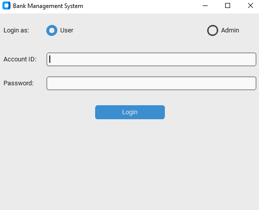
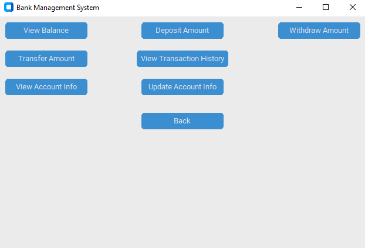

# Bank Management System

## Overview
The Bank Management System is a Python-based application that provides a graphical user interface (GUI) for managing bank accounts. It allows administrators to create and delete user accounts, and users can view account details, deposit and withdraw money, transfer funds, and view transaction history. The application uses SQLite for database management and CustomTkinter for the GUI.
## Authors

- [@hassanqureshi](https://www.github.com/m-hassanqureshi)
- [@ahmadkhawaja](https://www.github.com/Khawajaa07)
- [@moeedzahid](https://www.github.com/mmoeedz )
## Screenshots
 

## Features
- **Admin Functions:**
  - Create user accounts
  - Delete user accounts

- **User Functions:**
  - View account balance
  - Deposit money
  - Withdraw money
  - Transfer money to another account
  - View transaction history
  - Update account information

## Prerequisites
- Python 3.x
- Required Python packages:
  - `sqlite3`
  - `tkinter`
  - `customtkinter`
  - `ttk`

## Installation

1. **Clone the repository:**
    ```sh
    git clone https://github.com/yourusername/bank-management-system.git
    cd bank-management-system
    ```

2. **Install dependencies:**
    Ensure you have all required packages installed. You can install CustomTkinter using pip:
    ```sh
    pip install customtkinter
    ```

## Usage

1. **Run the application:**
    ```sh
    python bank-management-system.py
    ```

2. **Login:**
   - **Admin Login:** Select "Admin" and enter the admin name and password.
   - **User Login:** Select "User" and enter the account ID and password.

3. **Admin Functions:**
   - After logging in as an admin, you can create or delete user accounts.

4. **User Functions:**
   - After logging in as a user, you can perform various banking operations like viewing the balance, depositing, withdrawing, transferring money, viewing transaction history, and updating account information.

## Code Structure

- `bank-mmanagement-system.py`: Contains the main application logic and GUI setup.
- `DataBaseTasks`: Class handling all database-related operations.
- `Bank`: Class containing business logic for banking operations.
- `App`: Class managing the GUI and user interactions.

## License
This project is licensed under the MIT License.

## Contributing
Contributions are welcome! Please fork the repository and submit a pull request for review.

## Contact
For questions or suggestions, please open an issue or contact at [Linkedin](https://www.linkedin.com/in/m-hassan-qureshi/).
